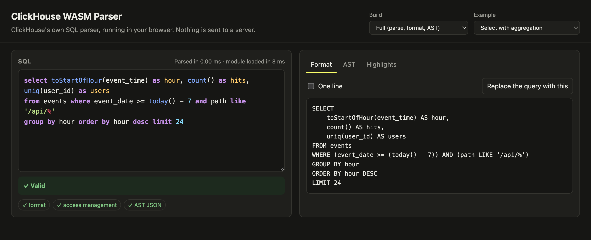

# Browser example: Vite



A small Vite + TypeScript app that uses `@clickhouse/wasm-parser` in the
browser. It is both an integration example and an in-browser playground:

- an editor with parser-accurate syntax highlighting, which keeps working on
  incomplete SQL
- live syntax errors with line, column and the tokens the parser expected
- formatting, pretty or on one line
- the AST as JSON, and the round trip back to SQL through `formatJson`
- the highlight ranges as a table, with their UTF-8 byte offsets
- a switch between the full and the slim build

Everything runs in the page; no query leaves the browser.

## Run it

From the repository root:

```bash
npm install                 # builds the package into dist/
cd examples/vite-app
npm install
npm run dev                 # http://localhost:5173
```

`npm run build` type-checks and produces a static site in `dist/`, and
`npm run preview` serves it.

## How the integration works

All of it is in [`src/main.ts`](src/main.ts):

```ts
import { Parser } from '@clickhouse/wasm-parser';

await Parser.init();                          // fetches and instantiates the module once
const result = Parser.parse(sql);             // synchronous from here on
```

- **No bundler configuration.** The package locates its `.wasm` with
  `new URL('../wasm/parser.wasm', import.meta.url)`, which Vite recognizes. It
  emits the file as a hashed asset in production and serves it in development.
  [`vite.config.ts`](vite.config.ts) only exists because this example links the
  package from `../..`, outside the app folder. An app that installs the package
  normally doesn't need it.
- **Both builds are separate assets.** Importing `@clickhouse/wasm-parser/slim`
  as well adds the smaller module. Import only the one you need to ship less.
- **Byte offsets.** Highlights and error positions are UTF-8 byte offsets.
  [`src/offsets.ts`](src/offsets.ts) converts them to string indices, and
  [`src/highlight.ts`](src/highlight.ts) uses that to build the colored overlay.
  Without the conversion, colors drift as soon as the query contains a
  non-ASCII character. The "Non-ASCII text" example shows it.
- **The editor** is a transparent `<textarea>` over a `<pre>` holding the
  colored text. Both use the same font and padding so the characters line up.
  An editor library can use the same `highlights` array instead.

## Known limitation

For some ordinary nested queries, such as `x IN (SELECT …)` or a subquery
inside a subquery, the module parses the query but cannot serialize its AST
(`ast` is `null` and `ast_error` says "Stack size too large"). Highlighting,
errors and formatting still work. The AST tab shows the reason when it happens.
The cause is the module's stack size, set by its build in ClickHouse.
